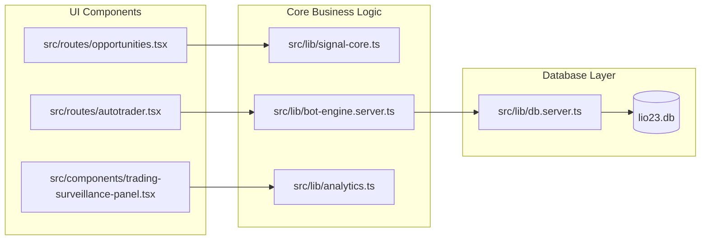

# Graphify — Codebase Structural Graph & Architecture Mapper

Graphify transforms a project's codebase (source files, API routes, database schemas, and configuration models) into a structured, queryable knowledge graph and visual Mermaid architecture diagrams.

---

## Core Capabilities

1. **AST Dependency Mapping**: Deterministic parsing of TypeScript/React/SQLite imports, exports, and function calls.
2. **Mermaid Architecture Exporter**: Generates clean, GitHub-rendered Mermaid flowcharts for complex pipelines.
3. **Graph Reports**: Creates structural overview summaries (`GRAPH_REPORT.md`).
4. **Token-Efficient Context**: Allows agents to traverse file relationships and call trees without re-reading thousands of raw lines.

---

## Standard Workflow

### 1. Architectural Call Flow (Trading Engine)

```mermaid
graph TD
    UI_Opp["/opportunities (UI)"] -->|POST /api/bot (action: execute)| API_Bot["src/routes/api/bot.ts"]
    UI_Auto["/autotrader (UI)"] -->|useAutoTraderEngine| Engine_Client["src/lib/autotrader.ts"]
    
    API_Bot -->|startBotForUser / forceTradeForUser| Engine_Server["src/lib/bot-engine.server.ts"]
    
    Engine_Server -->|analyzeSymbolCore / computeOpportunityStake| Signal_Core["src/lib/signal-core.ts"]
    Engine_Client -->|analyzeSymbolCore / computeOpportunityStake| Signal_Core
    
    Signal_Core -->|generateSignal / rsi / macd| Indicators["src/lib/indicators.ts"]
    Signal_Core -->|evaluateStrategies| Strategies["src/lib/strategies.ts"]
    
    Engine_Server -->|proposal -> validation -> buy| Deriv_API["Deriv Options WS API"]
    Engine_Server -->|logTrade / updateRiskState| DB["SQLite (lio23.db)"]
```

---

### 2. Component & File Hierarchy Map



---

## Verification & Commands

- To update or generate project relationship reports, run structural AST scans over `src/lib/` and `src/routes/`.
- Export call flows into markdown artifacts using standard GitHub Flavored Markdown `mermaid` blocks.
